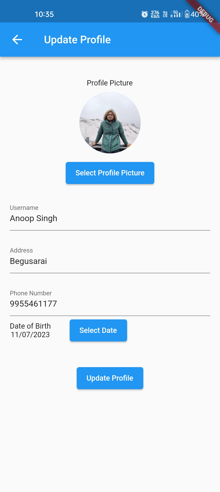

# E-Commerce App Project

## Table of Contents

- [Overview](#overview)
- [Demo](#demo)
- [Screenshots](#screenshots)
- [Features](#features)
- [Installation](#installation)
- [Usage](#usage)
- [Feedback](#feedback)


## Overview

This is an e-commerce app built using Flutter and Firebase Cloud Firestore. It provides a platform for users to browse and purchase products online. The app integrates the Razorpay payment gateway for secure and convenient payment processing.

## Demo

You can download the latest version of the app by clicking [here](build\app\outputs\flutter-apk\app-release.apk).

A link to a video demo of the app.
[[https://www.youtube.com/watch?v=0g-jPhgflOs](https://youtu.be/6wqqMTScIwc)](https://youtu.be/6wqqMTScIwc)


## Screenshots

Here are some screenshots of the Social Networking Website to give you a glimpse of its various pages and features.

## Login Page


## Registration Page


## Home Page


## Detail Page


## Cart Page


## Checkout Page


## Payment Page


## Success Page


## User Profile Page


## Edit Profile Page



## WishList Page


## Orders Page


These screenshots provide an overview of the website's design and user interface. The actual website may have additional features and pages not depicted here.


## Features

### 1. User Authentication

- Sign up and login functionality to create and access user accounts.
- Secure authentication using Firebase Authentication.

### 2. Product Catalog

- Display a wide range of products with details such as name, price, description, and images.
- Organize products into categories and allow users to filter and search for specific items.
- Implement a smooth and intuitive user interface for easy navigation.

### 3. Shopping Cart

- Enable users to add products to their shopping cart for later purchase.
- Allow users to modify quantities, remove items, and view the total cost of their cart.
- Persist the cart across app sessions for a seamless shopping experience.

### 4. Order Management

- Provide users with an order history, allowing them to track their previous purchases.
- Enable users to view order details, including product information, quantities, and total cost.
- Implement push notifications to keep users informed about order status updates.

### 5. Payment Processing

- Integrate the Razorpay payment gateway for secure and reliable payment transactions.
- Allow users to choose from multiple payment methods (credit card, debit card, net banking, etc.).
- Handle payment success and failure scenarios, providing appropriate feedback to users.


### 6. Wishlist and Favorites

- Enable users to create a wishlist of products they are interested in but not ready to purchase.
- Allow users to mark certain products as favorites for quick access and future reference.

### 7. User Profile

- Provide users with a personalized profile where they can manage their account information, shipping addresses, and payment methods.
- Allow users to update their profile picture and customize their display name.

<!-- User Reviews and Ratings
Allow users to rate and write reviews for products they have purchased.
Display average ratings and reviews for each product to help users make informed decisions.
Implement a moderation system to manage and filter user-generated content. -->

<!-- Notifications
Implement push notifications to keep users informed about new product arrivals, discounts, and promotions.
Allow users to customize their notification preferences based on their interests. -->

<!-- Order Tracking and Delivery
Integrate with delivery services or provide a manual system for users to track their orders.
Display estimated delivery dates and shipping details to keep users informed about their purchases.

Customer Support
Offer a support section where users can contact customer service with queries and issues.
Provide options for live chat, email support, or phone support. -->

## Installation

To run the app locally, follow these steps:

### Prerequisites

- Flutter installed on system

### 1. Clone the repository
```bash
git clone https://github.com/anoop7384/e-commerce-app.git
```

### 2. Install dependencies
```bash
flutter pub get
```

### 4. Connect Firebase:

- Set up a Firebase project and obtain the necessary configuration files.
- Add the configuration files to the project's android/app and ios/Runner directories.
- Follow the Firebase documentation for Flutter to configure Firebase services in your project.

### 5. Run the app
```bash
flutter run
```


## Feedback
We appreciate your feedback and are dedicated to providing a positive user experience. If you have any suggestions, encounter issues, or need support, please reach out to our support team at anoop553407@gmail.com.
